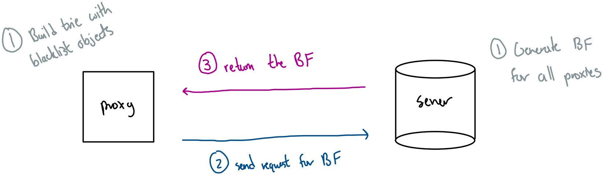
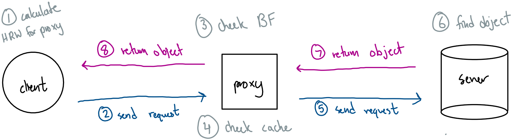
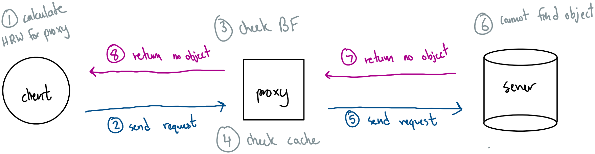
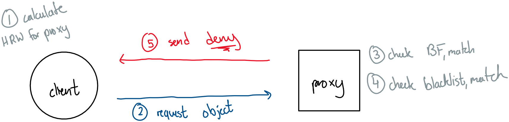
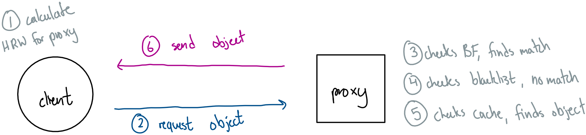
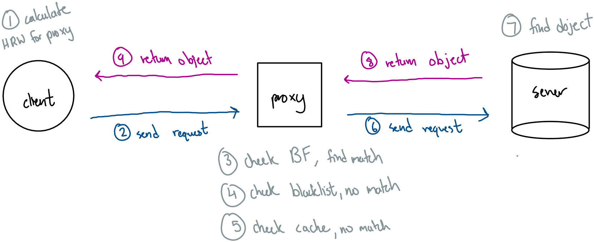
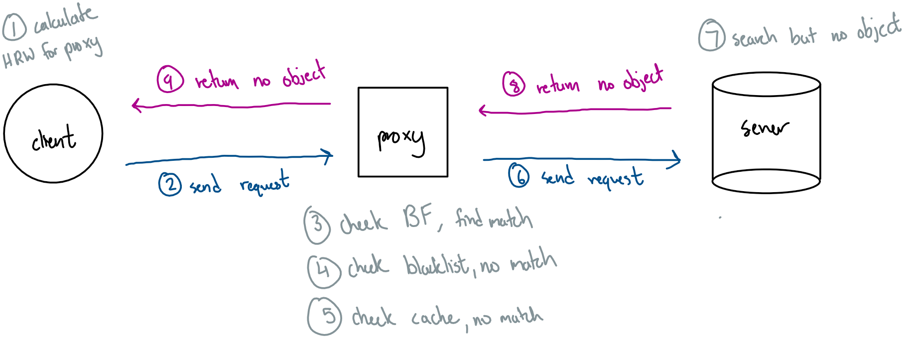

<a name="overview"/>

TLS Cache
=========
A Final Project for CS165 Computer Security designed by Jacob Tan and Richard Duong 
[Link to the Github Repository here](https://github.com/richard-duong/TLSCache) 

## Objective:
Implement a secure proxy application using TLS protocol to provide simple authentication and secure file transmission. With this, we can demonstrate how a large scale system with a server caching objects inside of proxies can interact with a client and provide objects upon request in a secure and optimal manner. 
[The full assignment specifications](docs/finalproject.pdf)  

___
<a name="table-of-contents"/>

Table of Contents
=================
1. [Overview](#overview) 
2. [Table of Contents](#table-of-contents) 
3. [How to use](#how-to-use) 
4. [Phase Design](#phase-design) 
        a) [Initialization](#initial-phase) 
        b) [Standard Application Process](#standard-phase) 
        c) [Nonstandard Application Process with False Positives](#nonstandard-phase) 
5. [Component Design](#component-design) 
        a) [Packet](#packet-design) 
        b) [TLS](#tls-design) 
        c) [Rendezvous Hashing](#rendezvous-hashing-design) 
        d) [Bloom Filter](#bloom-filter-design) 
        e) [Trie](#trie-design) 
6. [System Design](#system-design) 
        a) [Client](#client-design) 
        b) [Server](#server-design) 
        c) [Proxy](#proxy-design) 
        d) [Blacklist](#blacklist-design) 
7. [Distribution of Work](#distribution-of-work) 
        a) [Jacob's Contributions](#jacob-contribution) 
        b) [Richard's Contributions](#richard-contribution) 
8. [Final Words](#final-words) 
9. [References](#references) 

___
<a name="how-to-use"/>

How to use
==========

___
<a name="phase-design"/>

Phase Design
============

**1) Initialization** 
This phase prepares the server and proxies with the appropriate blacklists & Bloom Filters  

**2) Standard Application Process** 
This phase evaluates our clients' requests without a match on the Bloom Filter  

**3) Nonstandard Application Process with False Positives** 
This phase evaluates our clients' requests with a match on the Bloom Filter    

<a name="initial-phase"/>

## 1) Initialization

<a name="initial-phase-server"/>

### Server Initialization
**Has access to:**
- Entire object file 
- Blacklist object file 
- Proxy name/port list 
- HRW hash key 
- BF hash keys 

**Steps:**
- Read objects from file 
- Generate Bloom Filter for each proxy to use 
- Wait for all proxies to connect  
  
    

<a name="initial-phase-proxy"/>

### Proxy Initialization
**Has access to:**
- Server port 
- TLS certificate 
- Relevant blacklist object file 

**Steps:**
- Generate trie from reading relevant blacklist 
- Request the Bloom Filter from the server 
- Retrieve and copy the Bloom Filter from the buffer  
  
    

<a name="initial-phase-client"/>

### Client Initialization
**Steps:**
- Wait for server to finish receiving initial connections from all proxies 
- Generate proxies.txt and keys.txt for client applications to use later 
- Read and store proxies.txt and keys.txt  
  
    

<a name="standard-phase"/>

## 2) Standard Application Process
This phase is the standard application process. In the standard application process, we are anticipating an object request that does not produce a false positive in the Bloom Filter. If the client makes a request to the application, they're expected to encounter one of these four scenarios.  
**Scenario 1: Client requests object on proxy** 
**Scenario 2: Client requests object on server** 
**Scenario 3: Client requests nonexistent object** 
**Scenario 4: Client requests blacklisted object**  

<a name="standard-phase-scene-1"/>

### Scenario 1: Client requests object on proxy
**Steps:**
- Client runs HRW on object to determine which proxy holds the cached object 
- Client requests object from result proxy 
- Proxy checks if object is on Bloom Filter for blacklisted objects, finds no match 
- Proxy checks local cache for object, finds object 
- Proxy returns object to Client  
  
    

<a name="standard-phase-scene-2"/>

### Scenario 2: Client requests object on server
**Steps:**
- Client runs HRW on object to determine which proxy holds the cached object 
- Client requests object from result proxy 
- Proxy checks if object is on Bloom Filter for blacklisted objects, finds no match 
- Proxy checks local cache for object, finds no match 
- Proxy requests object from server 
- Server checks locally for object, finds object 
- Server returns object to Proxy 
- Proxy returns object to Client  
  
    

<a name="standard-phase-scene-3"/>

### Scenario 3: Client requests nonexistent object
**Steps:**
- Client runs HRW on object to determine which proxy holds the cached object 
- Client requests object from result proxy 
- Proxy checks if object is on Bloom Filter of blacklisted objects, finds no match 
- Proxy checks local cache for object, finds no match 
- Proxy requests object from server 
- Server checks locally for object, finds no match 
- Server returns *no object found* to Proxy 
- Proxy returns *no object found* to Client  
  
    

<a name="standard-phase-scene-4"/>

### Scenario 4: Client requests blacklisted object
**Steps:**
- Client runs HRW on object to determine which proxy holds the cached object 
- Client requests object from result proxy 
- Proxy checks if object is on Bloom Filter of blacklisted objects, finds match 
- Proxy checks if object is on Trie of blacklisted objects, finds match 
- Proxy returns *access deny* to Client  
  
    

<a name="nonstandard-phase"/>

## 3) Nonstandard Application Process with False Positives
This phase is the nonstandard application process. In the nonstandard application process, we are anticipating an object request that produces false positive on the Bloom Filter. With a false positive, that means the situation where the client requests a blacklisted object is excluded. If the client makes a request to the application, they're expected to encounter one of these three scenarios.  

**Scenario 1: Client requests object on proxy** 
**Scenario 2: Client requests object on server** 
**Scenario 3: Client requests nonexistent object**  

<a name="nonstandard-phase-scene-1"/>

### Scenario 1: Client requests object on proxy
**Steps:**
- Client runs HRW on object to determine which proxy holds the cached object 
- Client requests object from result proxy 
- Proxy checks if object is on Bloom Filter for blacklisted objects, finds match 
- Proxy checks if object is on Trie of blacklisted objects, finds no match (false positive) 
- Proxy checks local cache for object, finds object 
- Proxy returns object to Client  
  
    

<a name="nonstandard-phase-scene-2"/>

### Scenario 2: Client requests object on server
**Steps:**
- Client runs HRW on object to determine which proxy holds the cached object 
- Client requests object from result proxy 
- Proxy checks if object is on Bloom Filter for blacklisted objects, finds match 
- Proxy checks if object is on Trie of blacklisted objects, finds no match (false positive) 
- Proxy checks local cache for object, finds object 
- Proxy requests object from server 
- Server checks locally for object, finds object 
- Server returns object to Proxy 
- Proxy returns object to Client  
  
    

<a name="nonstandard-phase-scene-3"/>

### Scenario 3: Client requests nonexistent object
**Steps:**
- Client runs HRW on object to determine which proxy holds the cached object 
- Client requests object from result proxy 
- Proxy checks if object is on Bloom Filter for blacklisted objects, finds match 
- Proxy checks if object is on Trie of blacklisted objects, finds no match (false positive) 
- Proxy checks local cache for object, finds no match 
- Proxy requests object from server 
- Server checks locally for object, finds no match 
- Server returns *no object found* to Proxy 
- Proxy returns *no object found* to Client  
  
    

___
<a name="component-design"/>

Component Design
================

<a name="packet-design"/>

## Packet Design
The packet design is a lot simpler, where you can just incorporate a message. However, since proxies and clients will be receiving different types of packets, we need some way of specifying the type of specification. Therefore we've reduced it down to 5 prefixes on the packet that will specify what to anticipate with packet requests coming in and packets sent out. The 5 packet prefixes are: **INI**, **GET**, **PUT**, **NON**, **DEN**.  

**INI** 
+ Used by the proxy during [Proxy Initialization](#initial-phase-proxy) to notify the server that the proxy is ready, and to request the bloom filter from the server.  
+ Used by the server to respond to the proxy during [Proxy Initialization](#initial-phase-proxy) to receive the bloom filter from the server.  

**GET** 
+ Used by the client during 

<a name="tls-design"/>

## TLS Design

<a name="rendezvous-hashing-design"/>

## Rendezvous Hashing Design
The [Rendezvous Hash](https://en.wikipedia.org/wiki/Rendezvous_hashing) is used to solve the distributed hash table problem. In this case, we have many objects distributed across multiple proxies. In order to ensure a relatively even distribution of objects, let **O** denote the object name, **P** denote the proxy name, and **h(S)** be the [Polynomial Rolling Hash Function](https://en.wikipedia.org/wiki/Rolling_hash). To determine which proxy to send the object to, we run **h(O||P)** for each proxy, and select the largest hash value. Whichever proxy was used in that largest hash value, is the proxy that will receive the object.  

<a name="bloom-filter-design"/>

## Bloom Filter Design

<a name="trie-design"/>

## Trie Design

___
<a name="system-design"/>

System Design
=============

<a name="client-design"/>

## Client Design

<a name="server-design"/>

## Server Design

<a name="proxy-design"/>

## Proxy Design

<a name="blacklist-design"/>

## Blacklist Design

___
<a name="distribution-of-work"/>

Distribution of work
====================

<a name="jacob-contribution"/>
  
## Jacob's Contributions
+ Created Rendezvous hashing design 
+ Created Bloom Filter design 

<a name="richard-contribution"/>  

## Richard's Contributions  
+ Designed the [README](README.md) 
+ Created Server/Proxy/Client Architecture 
+ Created the Packet design 

___ 
<a name="final-words"/>

Final Words
===========

___
<a name="references"/>

References
==========

[Murmur Hash](https://en.wikipedia.org/wiki/MurmurHash) 
[Murmur Hash Header](https://github.com/rurban/smhasher/blob/master/MurmurHash3.h) 
[Murmur Hash Implementation](https://github.com/rurban/smhasher/blob/master/MurmurHash3.cpp) 
[Bloom Filter Analysis](https://www.cs.ucr.edu/~ravi/Papers/Jrnl/BloomFilterAnalysis.pdf) 
[TLS Manual](https://man.openbsd.org/tls_init.3) 
[Bob Beck TLS Tutorial](https://github.com/bob-beck/libtls/blob/master/TUTORIAL.md) 
[Certificate Authority](https://en.wikipedia.org/wiki/Certificate_authority) 
[Consistent Hashing](https://en.wikipedia.org/wiki/Consistent_hashing) 
