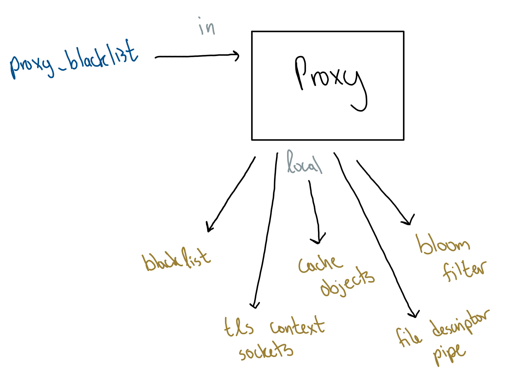

<a name="overview"/>

TLS Cache
=========
A Final Project for CS165 Computer Security designed by Jacob Tan and Richard Duong<br>
[Link to the Github Repository here](https://github.com/richard-duong/TLSCache)<br>

## Objective:
Implement a secure proxy application using TLS protocol to provide simple authentication and secure file transmission. With this, we can demonstrate how a large scale system with a server caching objects inside of proxies can interact with a client and provide objects upon request in a secure and optimal manner.<br>
[The full assignment specifications](docs/finalproject.pdf)<br><br>


-----------------------------
<a name="table-of-contents"/>


Table of Contents
=================
1. [Overview](#overview)<br>
2. [Table of Contents](#table-of-contents)<br>
3. [How to use](#how-to-use)<br>
4. [Phase Design](#phase-design)<br>
        a) [Initialization](#initial-phase)<br>
        b) [Standard Application Process](#standard-phase)<br>
        c) [Nonstandard Application Process with False Positives](#nonstandard-phase)<br>
5. [Component Design](#component-design)<br>
        a) [Packet](#packet-design)<br>
        b) [Rendezvous Hashing](#rendezvous-hashing-design)<br>
        c) [Bloom Filter](#bloom-filter-design)<br>
6. [System Design](#system-design)<br>
        a) [Client](#client-design)<br>
        b) [Server](#server-design)<br>
        c) [Proxy](#proxy-design)<br>
        d) [Blacklist](#blacklist-design)<br>
7. [Distribution of Work](#distribution-of-work)<br>
        a) [Jacob's Contributions](#jacob-contribution)<br>
        b) [Richard's Contributions](#richard-contribution)<br>
8. [Final Words](#final-words)<br>
9. [References](#references)<br>


----------------------
<a name="how-to-use"/>

How to use
==========
This repository contains the starter code for the CS165 project. The directory structure is as follows:
```
certificates/		// Contains CA and server certificates.
        server_proxy/   // Certificates for server(server) and proxy(client) 
	client_proxy/	// Certificates for proxy(server) and client(client)
scripts/		// Helper scripts.
	env.sh		// Script helps link libraries (run this before screen)
	setup.sh	// Run this once to setup the appropriate libraries
	reset.sh	// Reset the environment
src/			// Source code for the TLSCache Application
	components/	// Components used for HRW, Bloom Filter, and Definitions
	system/		// Server/Proxy/Client Code and Architecture
	tests/		// Unit and Integration Tests
cmake/			// CMake find script. 
extern/			// Required third party tools and libraries- LibreSSL & CMake.
licenses/		// Open source licenses for code used.
data/          		// Input files used by the client, proxy, and servers
docs/           	// Pictures and documents used in the overview design of the site
```


### Steps (First Time)
1. Download and extract the code.
2. Run the following commands:
```
Prepare the environment
$ cd TLSCache
$ source scripts/setup.sh

Generate the server/proxy certificates
$ cd TLSCache
$ cd certificates/server_proxy/
$ make

Generate client/proxy certificates
$ cd TLSCache
$ cd certificates/client_proxy/
$ make

Build the TLS Application
$ cd TLSCache/build/
$ make
```


### To run the system:
```
$ cd TLSCache
$ source scripts/env.sh

Launch another terminal, screen, or tmux
Run the server:
$ ./build/src/server

Launch another 5 terminals, screens, or tmux
Run the proxies on each shell separately:
$ ./build/src/proxy 0
$ ./build/src/proxy 1
$ ./build/src/proxy 2
$ ./build/src/proxy 3
$ ./build/src/proxy 4

Launch another terminal, screen, or tmux
Run the client
$ ./build/src/client 1
```


### How to change inputs for client object requests
Edit files in the data directory
```
$ cd TLSCache/data/
$ vim client0_requests.min
```
The default request files are meant to help you with different test cases<br><br>
1. Test your own inputs on file `client0_requests.min` which can be ran with `$ ./build/src/client 0`.
2. To see an example of all **found object, not found object, and blacklisted object** run `client1_requests.min` with `$ ./build/src/client 1`
3. To see an example of duplications and **objects being added and accessed on the cache**, run `client2_requests.min` with `$ ./build/src/client 2`


### Scripts included
1. `setup.sh` should be run exactly once after you have downloaded code, and never again. It extracts and builds the dependencies in extern/, and builds and links the code in src/ with LibreSSL.
2. `reset.sh` reverts the directory to its initial state. It does not touch `src/` or `certificates/`. Run `make clean` in `certificates/` to delete the generated certificates.
3. `env.sh` should be from the project directory `TLSCache` each time you start up a new terminal. If you're using screen, run this script first before starting your screen so all sub-screens will have the libraries linked.


------------------------
<a name="phase-design"/>

Phase Design
============

**1) Initialization**<br>
This phase prepares the server and proxies with the appropriate Blacklists & Bloom Filters<br>

**2) Standard Application Process**<br>
This phase evaluates our clients' requests without a match on the Bloom Filter<br>

**3) Nonstandard Application Process with False Positives**<br>
This phase evaluates our clients' requests with a match on the Bloom Filter<br><br><br><br>


<a name="initial-phase"/>

## Initialization
Before being able to run the TLS application, we need to be able to set up the system so that we instantiate the Bloom Filters and Blacklists on each proxy. The way the Server, Proxy, and Client interacts and sets up their own systems is important during this time.<br>
+ **Server Initialization**<br>
+ **Proxy Initialization**<br>
+ **Client Initialization**<br><br>


<a name="initial-phase-server"/>

### Server Initialization
**Has access to:**
- Entire object file<br>
- Blacklist object file<br>
- Proxy name/port list<br>
- Appropriate "Server TLS" Root, Key, and Cert<br>

**Steps:**
- Read and store requestable objects from file<br>
- Read and store blacklisted objects from file<br>
- Distribute blacklisted objects into files for each proxy to read from later<br>
- Configure TLS contexts and setup listening socket<br><br>
<br><br><br><br>


<a name="initial-phase-proxy"/>

### Proxy Initialization
**Has access to:**
- Relevant blacklist file<br>
- Appropriate "Client TLS" Root<br>
- Appropriate "Server TLS" Root, Key, and Cert<br>

**Steps:**
- Read blacklist for the specified proxy<br>
- Create a local bloom filter with blacklisted objects as elements<br>
- Prepare a cache for objects to be stored on<br>
- Configure TLS contexts and setup listening/connection sockets<br>
- Prepare a file descriptor pipe for updating the cache<br><br>
<br><br><br><br>


<a name="initial-phase-client"/>

### Client Initialization
**Has access to:**
- Object Requests file<br>

**Steps:**
- Read in all object requests file from the corresponding client file<br>
- Configure TLS contexts and setup connection socket<br><br>
<br><br><br><br>


<a name="standard-phase"/>

## Standard Application Process
This phase is the standard application process. In the standard application process, we are anticipating an object request that does not produce a false positive in the Bloom Filter. If the client makes a request to the application, they're expected to encounter one of these four scenarios.<br>
+ **Scenario 1: Client requests object on proxy**<br>
+ **Scenario 2: Client requests object on server**<br>
+ **Scenario 3: Client requests nonexistent object**<br>
+ **Scenario 4: Client requests blacklisted object**<br><br>


<a name="standard-phase-scene-1"/>

### Scenario 1: Client requests object on proxy
- Client runs HRW on object to determine which proxy holds the cached object<br>
- Client requests object from result proxy<br>
- Proxy checks if object is on Bloom Filter for blacklisted objects, finds no match<br>
- Proxy checks local cache for object, finds object<br>
- Proxy returns object to Client<br><br>
<br><br><br><br>


<a name="standard-phase-scene-2"/>

### Scenario 2: Client requests object on server
- Client runs HRW on object to determine which proxy holds the cached object<br>
- Client requests object from result proxy<br>
- Proxy checks if object is on Bloom Filter for blacklisted objects, finds no match<br>
- Proxy checks local cache for object, finds no match<br>
- Proxy requests object from server<br>
- Server checks locally for object, finds object<br>
- Server returns object to Proxy<br>
- Proxy returns object to Client<br><br>
<br><br><br><br>


<a name="standard-phase-scene-3"/>

### Scenario 3: Client requests nonexistent object
- Client runs HRW on object to determine which proxy holds the cached object<br>
- Client requests object from result proxy<br>
- Proxy checks if object is on Bloom Filter of blacklisted objects, finds no match<br>
- Proxy checks local cache for object, finds no match<br>
- Proxy requests object from server<br>
- Server checks locally for object, finds no match<br>
- Server returns *\[NON\]* to Proxy<br>
- Proxy returns *\[NON\]* to Client<br><br>
<br><br><br><br>


<a name="standard-phase-scene-4"/>

### Scenario 4: Client requests blacklisted object
- Client runs HRW on object to determine which proxy holds the cached object<br>
- Client requests object from result proxy<br>
- Proxy checks if object is on Bloom Filter of blacklisted objects, finds match<br>
- Proxy does an additional validation check to see if object is on the local set of blacklisted objects, finds match<br>
- Proxy returns *\[DEN\]* to Client<br><br>
<br><br><br><br>


<a name="nonstandard-phase"/>

## Nonstandard Application Process with False Positives
This phase is the nonstandard application process. In the nonstandard application process, we are anticipating an object request that produces a *false positive* on the Bloom Filter. With a false positive, that means the situation where the client requests a blacklisted object is excluded. If the client makes a request to the application, they're expected to encounter one of these three scenarios.<br>
+ **Scenario 1: Client requests object on proxy**<br>
+ **Scenario 2: Client requests object on server**<br>
+ **Scenario 3: Client requests nonexistent object**<br><br>


<a name="nonstandard-phase-scene-1"/>

### Scenario 1: Client requests object on proxy
- Client runs HRW on object to determine which proxy holds the cached object<br>
- Client requests object from result proxy<br>
- Proxy checks if object is on Bloom Filter for blacklisted objects, finds match<br>
- Proxy does an additional validation check to see if object is on the local proxy set of blacklisted objects, finds no match (false positive)<br>
- Proxy checks local cache for object, finds object<br>
- Proxy returns object to Client<br><br>
<br><br><br><br>


<a name="nonstandard-phase-scene-2"/>

### Scenario 2: Client requests object on server
- Client runs HRW on object to determine which proxy holds the cached object<br>
- Client requests object from result proxy<br>
- Proxy checks if object is on Bloom Filter for blacklisted objects, finds match<br>
- Proxy does an additional validation check to see if object is on the local proxy set of blacklisted objects, finds no match (false positive)<br>
- Proxy checks local cache for object, finds object<br>
- Proxy requests object from server<br>
- Server checks locally for object, finds object<br>
- Server returns object to Proxy<br>
- Proxy returns object to Client<br><br>
<br><br><br><br>


<a name="nonstandard-phase-scene-3"/>

### Scenario 3: Client requests nonexistent object
- Client runs HRW on object to determine which proxy holds the cached object<br>
- Client requests object from result proxy<br>
- Proxy checks if object is on Bloom Filter for blacklisted objects, finds match<br>
- Proxy does an additional validation check to see if object is on the local proxy set of blacklisted objects, finds no match (false positive)<br>
- Proxy checks local cache for object, finds no match<br>
- Proxy requests object from server<br>
- Server checks locally for object, finds no match<br>
- Server returns *\[NON\]* to Proxy<br>
- Proxy returns *\[NON\]* to Client<br><br>
<br><br><br><br>


----------------------------
<a name="component-design"/>

Component Design
================

+ **Packet Design**<br>
+ **Rendezvous Hashing Design**<br>
+ **Bloom Filter Design**<br>


<a name="packet-design"/>

## Packet Design
The packet design when using TLS is much simpler than if one were to incorporate a checksum and manually encrypt, where you can just send . However, since proxies and clients will be receiving different types of packets, we need some way of specifying the type of specification. Therefore we've reduced it down to 4 prefixes on the packet that will specify what to anticipate with packet requests coming in and packets sent out. The 4 packet prefixes are: **GET**, **PUT**, **NON**, **DEN**.<br><br>


### GET
+ The client prefixes the object request with **GET** during [Standard Application Process](#standard-phase) and [Nonstandard Application Process](#nonstandard-phase) when sending a request to the proxy<br>
+ The proxy prefixes the object request with **GET** during [Standard Application Process](#standard-phase) and [Nonstandard Application Process](#nonstandard-phase) when sending a request to the server<br>

### PUT
+ The proxy prefixes the object data with **PUT** during [Standard Application Process](#standard-phase) and [Nonstandard Application Process](#nonstandard-phase) when returning the object to the client<br>
+ The server prefixes the object data with **PUT** during [Standard Application Process](#standard-phase) and [Nonstandard Application Process](#nonstandard-phase) when returning the object to the proxy<br>

### NON
+ The server returns a **NON** to the proxy during [Standard Client requests nonexistent object](#standard-phase-scene-3) and [Nonstandard Client requests nonexistent object](#nonstandard-phase-scene-3) if the object requested does not exist on the server<br>
+ The proxy returns a **NON** to the client during [Standard Client requests nonexistent object](#standard-phase-scene-3) and [Nonstandard Client requests nonexistent object](#nonstandard-phase-scene-3) if the object requested does not exist on the proxy or the server<br>

### DEN
+ The proxy returns a **DEN** to the client during [Standard Client requests blacklisted object](#standard-phase-scene-4) if the object requested was a blacklisted object<br><br><br><br>


<a name="rendezvous-hashing-design"/>

## Rendezvous Hashing Design
[Rendezvous (Highest Random Weight) Hash](https://en.wikipedia.org/wiki/Rendezvous_hashing) is an algorithm that is a solution to the distributed hash table problem. HRW is a general form of [Consistent Hashing](https://en.wikipedia.org/wiki/Consistent_hashing) and is far less complex and practical in application. We will be using HRW to distribute objects across all proxies for the specifications of this assignment.<br><br>

### How does Rendezvous Hashing work?

#### High level
Given an object to distribute and a list of proxies, we can generate a set of strings by adding the name of the object to each proxy.<br>
Here's an example<br>
```Object = "object1". Proxy 1 = "proxy1", Proxy 2 = "proxy2", Proxy 3 = "proxy3"```<br><br>

Then the strings would be 
```String1 = "object1proxy1", String2 = "object1proxy2", String3 = "object1proxy3"```<br><br>

We hash each of the strings and order them based on greatest to least<br>
```OrderedStrings = String2, String1, String3```<br><br>

And now we can determine an order for how we want to distribute the object. In the list, String2 has the **highest random weight** and correlates to **proxy2**. Therefore we would distribute the object to Proxy 2. However, if Proxy 2 is down, we would distribute it to the next correlated proxy on the list, which would be **proxy1**. And so on and so forth. As a result of this design, Rendezvous Hashing is very good when it comes to [Load Balancing](https://en.wikipedia.org/wiki/Load_balancing_(computing)) efficiently as well as minimizing disruption in case a proxy goes down, since all objects of the downed proxy will just be redistributed to the next largest hash.<br<br>

#### Theoretical
Let *O* denote the object name, *P* denote the set of proxy names for object distribution, *S* be a string, and *h(S)* be a hash function.<br>
We can say that *P* = {*P<sub>1</sub>*, *P<sub>2</sub>*, ... , *P<sub>n - 1</sub>*, *P<sub>n</sub>*} where any *P<sub>i</sub>* ∈ *P* s.t. 0 < *i* ≤ *n* <br>
Let *L* be the set of all strings that can be made by concatenating *O* to each *P*<sub>i</sub> ∀ *i*<br>
Then *L* = {(*O* || *P<sub>1</sub>*), (*O* || *P<sub>2</sub>*), ... , (*O* || *P<sub>n - 1</sub>*), (*O* || *P<sub>n</sub>)*} or<br>
*L* = {*L<sub>1</sub>*, *L<sub>2</sub>*, ... , *L<sub>n - 1</sub>*, *L<sub>n</sub>*} and each term can be denoted as *L<sub>i</sub>* ∀ *i*<br>
Then, we have the set of values *V* represent *h(*L<sub>i</sub>*) ∀ *i*<br>
If we order set *V* by greatest to least, we pick the **greatest** and **available** hash value as the proxy to distribute the object to.<br><br>

### Implementation
The Rendezvous Hash is implemented inside of `/src/components/hrw.h` and has the function signature of `HRW(string objname)` and 5 proxy names hardcoded into the implementation. We used [MurmurHash3](https://github.com/rurban/smhasher/blob/master/MurmurHash3.cpp) as the hash function of choice with a seed value of 1. The resulting value from calling the function would be the index of the proxy to distribute the object to. <br><br><br><br>


<a name="bloom-filter-design"/>

## Bloom Filter Design
[Bloom Filters](https://en.wikipedia.org/wiki/Bloom_filter#Extensions_and_applications) are a probabilitistic data structure that can test for existence of an element in a set. This is improved compared to testing for existence using a hash table that requires that we store all elements locally. With a bloom filter, we store a fraction of the memory while functioning at the same efficiency as a standard hash table.

### How do Bloom Filters work?

#### High Level
Let's say we have objects that we want to use and check for existence. We produce an array of bits flagged 0 and several hash functions that will be used on the elements.<br>
Here's an example<br>
```
objects[] = {"item1", "item2", "item3", "item4", "item5"};
bloom_filter size 15: [0, 0, 0, 0, 0, 0, 0, 0, 0, 0, 0, 0, 0, 0, 0]
```

### Implementation
The Bloom Filter is implemented inside of '/src/components/bf.h' and is a class


-------------------------
<a name="system-design"/>

System Design
=============


<a name="client-design"/>

## Client Design


<a name="server-design"/>

## Server Design


<a name="proxy-design"/>

## Proxy Design


<a name="blacklist-design"/>

## Blacklist Design


--------------------------------
<a name="distribution-of-work"/>

Distribution of work
====================

<a name="jacob-contribution"/>
  
## Jacob's Contributions
+ Created Rendezvous hashing design<br>
+ Created Bloom Filter design<br>


<a name="richard-contribution"/>  

## Richard's Contributions  
+ Designed the [README](README.md)<br>
+ Created Server/Proxy/Client Architecture<br>
+ Created the Packet design<br>


-----------------------
<a name="final-words"/>

Final Words
===========


----------------------
<a name="references"/>

References
==========

- [Murmur Hash](https://en.wikipedia.org/wiki/MurmurHash)<br>
- [Murmur Hash Header](https://github.com/rurban/smhasher/blob/master/MurmurHash3.h)<br>
- [Murmur Hash Implementation](https://github.com/rurban/smhasher/blob/master/MurmurHash3.cpp)<br>
- [Rendezvous Hashing](https://www.microsoft.com/en-us/research/wp-content/uploads/2017/02/HRW98.pdf)<br>
- [TLS Manual](https://man.openbsd.org/tls_init.3)<br>
- [Bob Beck TLS Tutorial](https://github.com/bob-beck/libtls/blob/master/TUTORIAL.md)<br>
- [Certificate Authority](https://en.wikipedia.org/wiki/Certificate_authority)<br>
- [Consistent Hashing](https://en.wikipedia.org/wiki/Consistent_hashing)<br>
